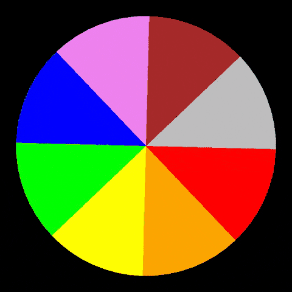
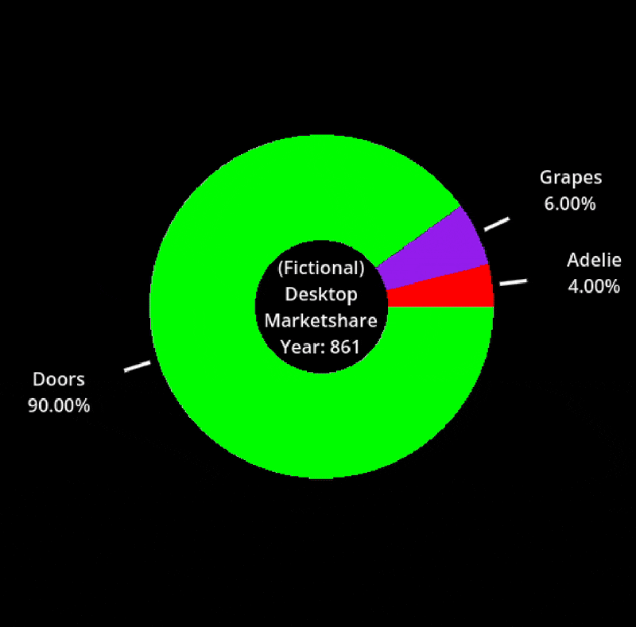
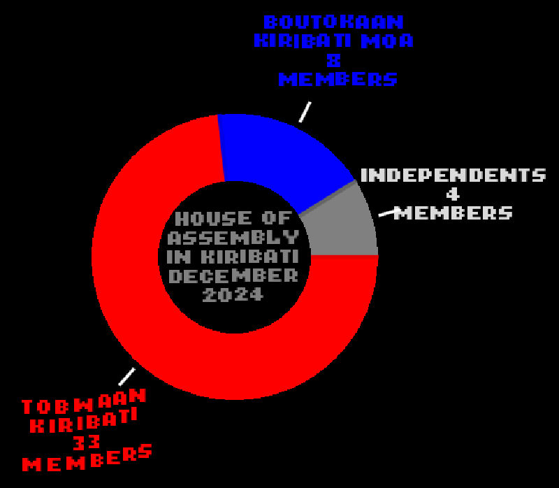
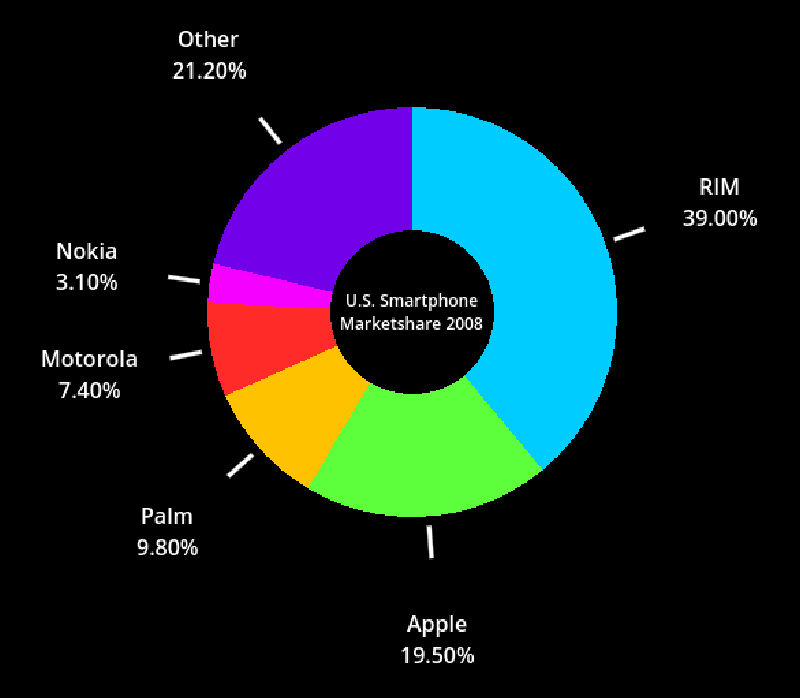

# Godot Pie Chart

A 2D customizable pie chart implementation for Godot Engine 4.4.

  
  
  
  

# How to use

The files to copy and use are in the folder named `src`. This project also contains examples and documentation in case you are lost.  

The files in `src` are only classes that act like built-in nodes, with no scenes to be ~~scene~~ seen.  Just instantiate them through `Add Child Node...`.

**The MIT License**

The MIT License (which is at ./LICENSE.txt) applies to all source code unless specified by another README.md with the corresponding license.

No, I'm **not** going to sue you for not including the License, but to those who are serious, read on.

The only requirement specified in the license is to include the text AND show it to the user at some point. This applies to all code in this repo. Though, there are many ways to fulfill the license, I have a template for you to start with.

	extends RichTextLabel
	func _ready() -> void:
		var file: FileAccess = FileAccess.open("res://path_to_license.txt", FileAccess.READ)
		var license: String = file.get_as_text()
		file.close()
		text = license

# Why did I make this?

I needed a pie chart implementation for a future project (which may or may not come out eventually). I forked from [this commit](https://github.com/Christmas-Missionary/Godot-PieChart/tree/9439e0bb8d0fecbef0027001ffb9ca1909242872), as it had a good starting point, and I saw some potential to expand upon it.

# Todo/Ideas

1. PieChartLegend node
2. Node icons?

# FAQ

**Can I contribute to this project?**

Yes, by:  

1. opening an issue to fix bug or propose a new feature
2. making a pull request fixing a bug or implementing a new **and tested** feature. (Make a new folder in the `tests` folder to test your new feature.)

**Will you do more work on this project?**

Maybe.

**The documentation for the custom classes doesn't show up. Now what?**

There are two solutions I can think of:  

1. Have the file name and class name be the same.  
For Example: `this_is_a_test.gd` -> `class_name ThisIsATest`  
I found out about this myself.  

2. Delete all the code in the file, save, then paste it back in. This should "force the documentation to refresh".  
[https://godotforums.org/d/33337-custom-class-documentation-not-showing-up](https://godotforums.org/d/33337-custom-class-documentation-not-showing-up)

**I was working on a project and now everything is gone.**  

Did you use git?
